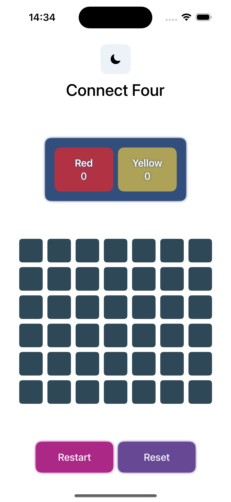
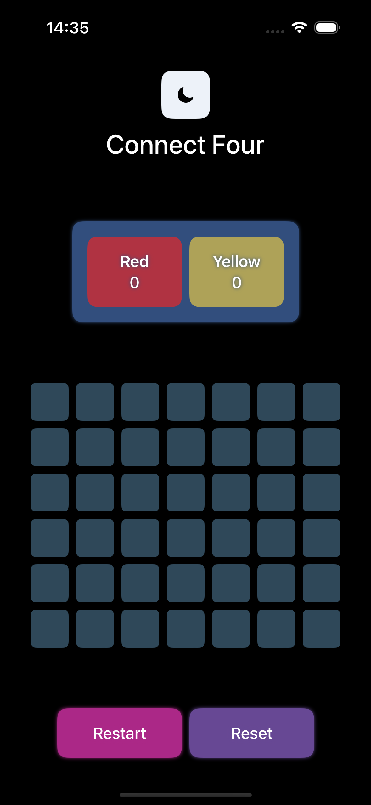

# Connect Four

## Description
This is a development project written in SwiftUI for iOS devices.

The project is a game of Connect Four to play on a single device, where two players take turns dropping a piece into a 7x6 grid. The first player to get four in a row wins.

## Features
- [x] Two players
- [x] Game board
- [x] Game logic
- [x] Game state
- [x] Game reset
- [x] Game restart
- [x] Game win detection

It is also possible to switch between light and dark mode by using the app toggle in the main interface.

## Screenshots

    <!-- Light theme screenshot -->
    
    <!-- Dark theme screenshot -->
    

